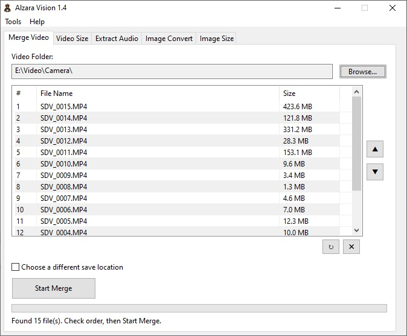
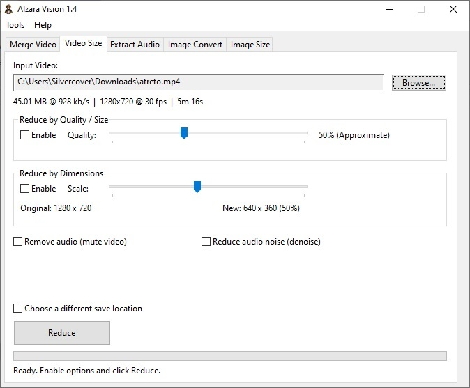
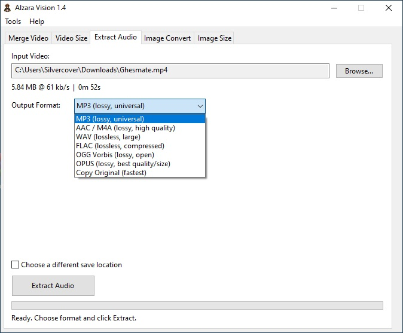
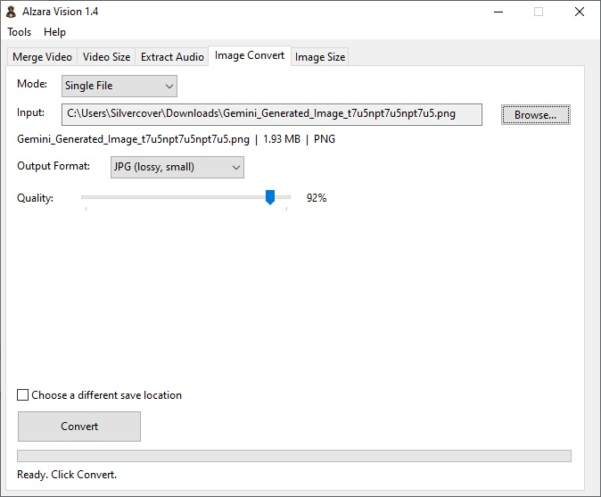
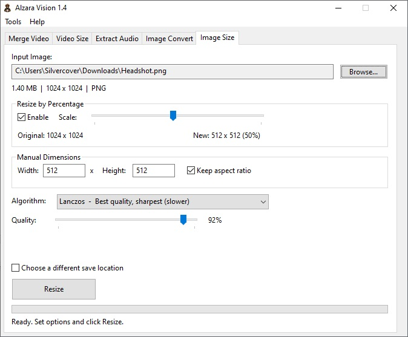

# Alzara Vision

**Alzara Vision** is a free, lightweight, Windows-based multimedia toolkit for video and image processing. It provides a simple graphical interface for common tasks such as merging video files, reducing video size, extracting audio, converting image formats, and resizing images. All media processing is powered by FFmpeg.

## Features

- **Merge Video** -- Merge multiple MP4 files in a folder into a single video file with natural sort order.
- **Video Size** -- Reduce video file size by adjusting quality, bitrate, and dimensions using H.265 (HEVC) encoding. Includes options for removing audio and reducing background noise.
- **Extract Audio** -- Extract audio from video files in various formats: MP3, AAC/M4A, WAV, FLAC, OGG, OPUS, or direct copy without re-encoding.
- **Image Convert** -- Convert images between formats. Supports HEIC, HEIF, PNG, WEBP, BMP, and TIFF as input, with JPG, PNG, and WEBP as output. Single file and batch (folder) modes available.
- **Image Size** -- Resize images by percentage or manual dimensions with aspect ratio lock. Supports multiple scaling algorithms: Fast Bilinear, Bilinear, Bicubic, and Lanczos.
- **Unicode Support** -- Full support for non-Latin filenames (Persian, Arabic, Chinese, etc.).
- **Real-time Progress** -- Progress bar and status updates during all operations.
- **Cancel Anytime** -- All operations can be cancelled mid-process.

## Screenshots

| Merge Video | Video Size |
|:-----------:|:----------:|
|  |  |

| Extract Audio | Image Convert |
|:-------------:|:-------------:|
|  |  |

| Image Size |
|:----------:|
|  |

## Requirements

- Windows 7 or later (Windows 10/11 recommended)
- FFmpeg executable (not included)

## Setup

1. Download the latest release of Alzara Vision.
2. Download FFmpeg from the official builds page:
   - https://www.gyan.dev/ffmpeg/builds/
   - Get the **essentials build** (static, release).
   - Extract the archive and locate `ffmpeg.exe` inside the `bin` folder.
3. Place `ffmpeg.exe` in the **same folder** as `AlzaraVision.exe`.
4. Run `AlzaraVision.exe`.

Your folder should look like this:

- AlzaraVision.exe 
- ffmpeg.exe

## Usage

Open the application and select the desired tab:

- **Merge Video** -- Select a folder containing MP4 parts. The files are listed in natural order. Click "Start Merge" to combine them.
- **Video Size** -- Select an MP4 file. Enable quality reduction, dimension reduction, audio removal, or noise reduction as needed. Click "Reduce".
- **Extract Audio** -- Select a video file. Choose the output audio format. Click "Extract Audio".
- **Image Convert** -- Choose single file or folder mode. Select input and output format. Click "Convert".
- **Image Size** -- Select an image file. Adjust dimensions using the slider or manual input. Choose a scaling algorithm. Click "Resize".

## License

This software is provided "AS IS", without warranty of any kind, express or implied. No guarantee of fitness for any purpose is provided. Use at your own risk. This software is free for personal and commercial use.

## Credits

- Created by Hamed Takmil (aka silvercover)
- This application uses FFmpeg for all media processing. FFmpeg is a trademark of Fabrice Bellard. Licensed under the GNU General Public License. https://ffmpeg.org

---

# Alzara Vision (فارسی)

**Alzara Vision** یک ابزار رایگان، سبک و مبتنی بر ویندوز برای پردازش ویدیو و تصویر است. این برنامه یک رابط گرافیکی ساده برای کارهای رایج مانند ادغام فایل‌های ویدیویی، کاهش حجم ویدیو، استخراج صدا، تبدیل فرمت تصویر و تغییر اندازه تصویر فراهم می‌کند. تمام پردازش‌های رسانه‌ای توسط FFmpeg انجام می‌شود.

## ویژگی‌ها

- **ادغام ویدیو** -- ادغام چندین فایل MP4 موجود در یک پوشه به یک فایل ویدیویی واحد با ترتیب طبیعی.
- **کاهش حجم ویدیو** -- کاهش حجم فایل ویدیویی با تنظیم کیفیت، بیت‌ریت و ابعاد با استفاده از کدک H.265 (HEVC). شامل گزینه‌های حذف صدا و کاهش نویز پس‌زمینه.
- **استخراج صدا** -- استخراج صدا از فایل‌های ویدیویی در فرمت‌های مختلف: MP3، AAC/M4A، WAV، FLAC، OGG، OPUS یا کپی مستقیم بدون تبدیل مجدد.
- **تبدیل تصویر** -- تبدیل تصاویر بین فرمت‌های مختلف. پشتیبانی از HEIC، HEIF، PNG، WEBP، BMP و TIFF به عنوان ورودی و JPG، PNG و WEBP به عنوان خروجی. حالت تکی و دسته‌ای (پوشه) موجود است.
- **تغییر اندازه تصویر** -- تغییر اندازه تصاویر بر اساس درصد یا ابعاد دستی با قفل نسبت تصویر. پشتیبانی از الگوریتم‌های مختلف: Fast Bilinear، Bilinear، Bicubic و Lanczos.
- **پشتیبانی از یونیکد** -- پشتیبانی کامل از نام فایل‌های غیرلاتین (فارسی، عربی، چینی و غیره).
- **نوار پیشرفت** -- نمایش نوار پیشرفت و وضعیت در تمام عملیات‌ها.
- **لغو در هر لحظه** -- تمام عملیات‌ها قابل لغو هستند.

## پیش‌نیازها

- ویندوز 7 به بعد (ویندوز 10/11 توصیه می‌شود)
- فایل اجرایی FFmpeg (همراه برنامه نیست)

## راه‌اندازی

1. آخرین نسخه Alzara Vision را دانلود کنید.
2. FFmpeg را از صفحه رسمی دانلود کنید:
   - https://www.gyan.dev/ffmpeg/builds/
   - نسخه **essentials build** (استاتیک، انتشار) را بگیرید.
   - فایل فشرده را باز کنید و فایل `ffmpeg.exe` را از داخل پوشه `bin` پیدا کنید.
3. فایل `ffmpeg.exe` را در **همان پوشه‌ای** که `AlzaraVision.exe` قرار دارد بگذارید.
4. برنامه `AlzaraVision.exe` را اجرا کنید.

پوشه شما باید به این شکل باشد:

- AlzaraVision.exe 
- ffmpeg.exe

## نحوه استفاده

برنامه را باز کنید و تب مورد نظر را انتخاب کنید:

- **ادغام ویدیو** -- پوشه‌ای حاوی قطعات MP4 را انتخاب کنید. فایل‌ها با ترتیب طبیعی لیست می‌شوند. روی "Start Merge" کلیک کنید.
- **کاهش حجم ویدیو** -- یک فایل MP4 انتخاب کنید. کاهش کیفیت، کاهش ابعاد، حذف صدا یا کاهش نویز را فعال کنید. روی "Reduce" کلیک کنید.
- **استخراج صدا** -- یک فایل ویدیویی انتخاب کنید. فرمت خروجی صوتی را انتخاب کنید. روی "Extract Audio" کلیک کنید.
- **تبدیل تصویر** -- حالت تکی یا پوشه را انتخاب کنید. ورودی و فرمت خروجی را مشخص کنید. روی "Convert" کلیک کنید.
- **تغییر اندازه تصویر** -- یک فایل تصویری انتخاب کنید. ابعاد را با اسلایدر یا ورود دستی تنظیم کنید. الگوریتم مقیاس‌گذاری را انتخاب کنید. روی "Resize" کلیک کنید.

## مجوز

این نرم‌افزار به صورت "همان‌طور که هست" ارائه می‌شود، بدون هیچ‌گونه ضمانت صریح یا ضمنی. هیچ تضمینی برای مناسب بودن برای هدف خاصی ارائه نمی‌شود. استفاده با مسئولیت خود شماست. این نرم‌افزار برای استفاده شخصی و تجاری رایگان است.

## اعتبارها

- ساخته شده توسط حامد تکمیل (با نام مستعار silvercover)
- این برنامه از FFmpeg برای تمام پردازش‌های رسانه‌ای استفاده می‌کند. FFmpeg علامت تجاری Fabrice Bellard است. تحت مجوز عمومی گنو (GPL) منتشر شده است. https://ffmpeg.org
